# Nirbana United EFC — Project Showcase

**Meditate. Dominate. Celebrate.**

A full-featured, bilingual website and club-management system built for
**Nirbana United EFC**, an eFootball Mobile club — a public site that stays
up to date automatically, plus a private admin dashboard the club captain
uses to run everything, no coding required.

🔗 **Live site:** https://nirbana-united-efc.netlify.app
📦 **Source code:** https://github.com/AishikBarua/nirbana-united-efc

Built with Next.js 14, TypeScript, Tailwind CSS, Prisma, and next-intl —
fully bilingual (English/Bengali), deployed on Netlify's free tier.

---

## At a glance

- 🌐 **Fully bilingual** — every page, every label, every date format, in
  English and Bengali, switchable instantly
- ⚡ **Self-updating** — club stats, match results, and rankings sync
  automatically every hour from the club's live tracker page
- 🔐 **Private admin dashboard** — full content management for players,
  matches, news, standings, and photos, with zero coding needed
- 💬 **Moderated community features** — visitors can comment on news and
  photos, signed only with a real roster name, approved by an admin before
  going public
- 📱 **Responsive** — looks and works great from a phone to a desktop
- 🔍 **Site-wide live search** and an automatic notifications feed
- 📊 **Real data visualizations** — hand-built charts (no heavy chart
  library) for career stats, win/draw/loss breakdowns, and season trends

---

## The public site

### Homepage

The landing page: club crest and tagline, quick stats (active members,
total wins, league position), the most recent match results, upcoming
fixtures, and the latest news — everything a visitor wants to see first.

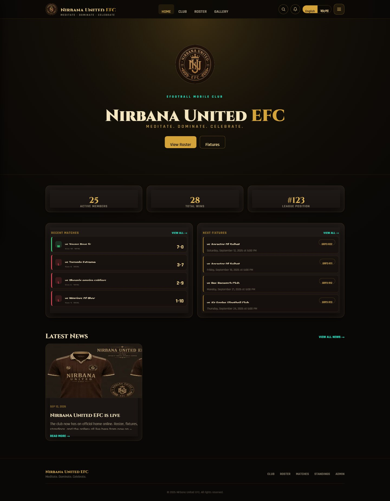

### Roster

Every squad member as a card — photo, in-game ID, position, all-time
tracker rank, and career stats (goals, matches, win rate) — sortable and
filterable by join date, position, and rank.

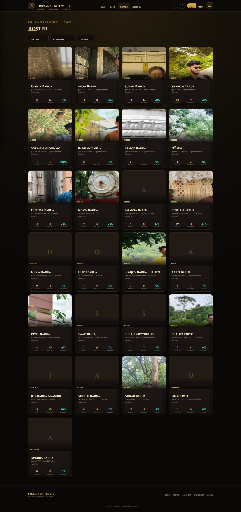

### Player profile

Click into any player for their full career breakdown: a win/draw/loss
donut chart, a career-vs-this-season comparison, a stats-over-time trend
line that fills in automatically as more tracker syncs happen, their
in-game squad cards, favorite player, and bio.

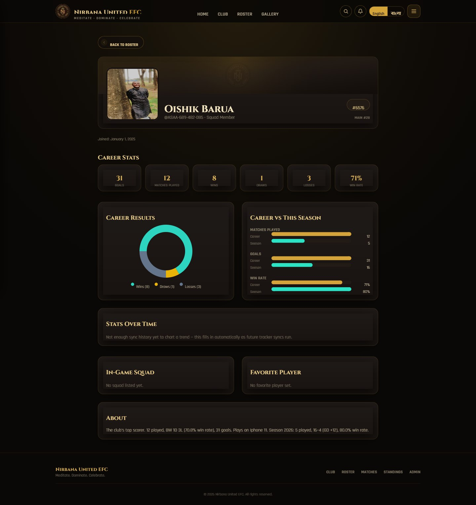

### Matches

Every fixture and result, home and away, with running win-rate stats.

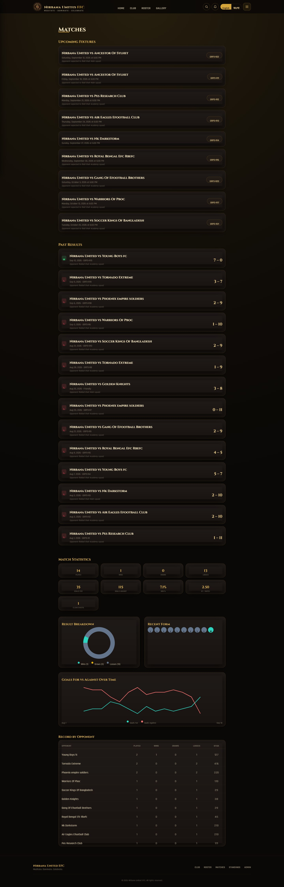

### Club

The club's own "About" page — history, founding year, and achievements,
all editable from the admin dashboard.

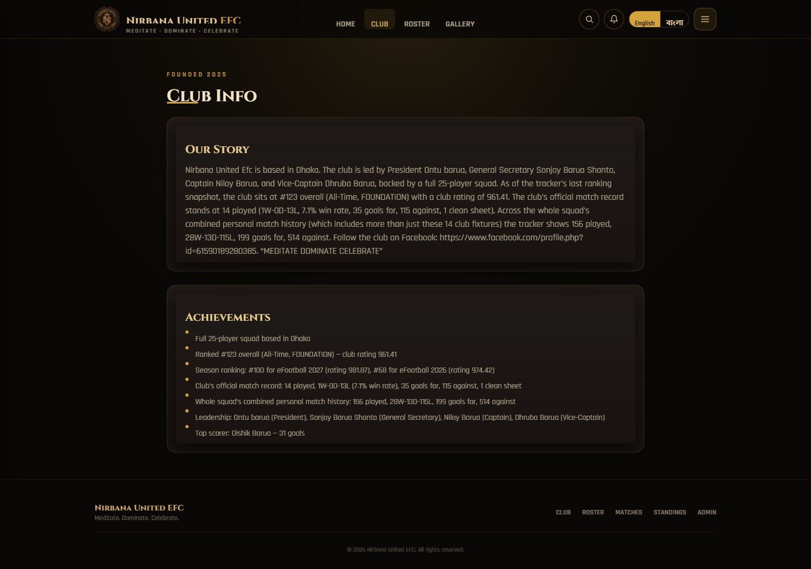

### Transfers & Rankings

A chronological transfer log (new signings, departures) and periodic
all-time/seasonal rank snapshots — both pulled straight from the club's
tracker page, no manual entry.

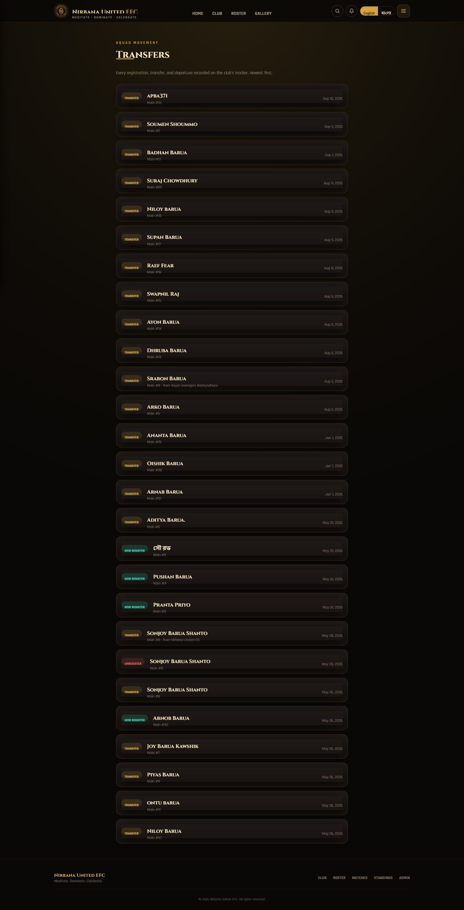

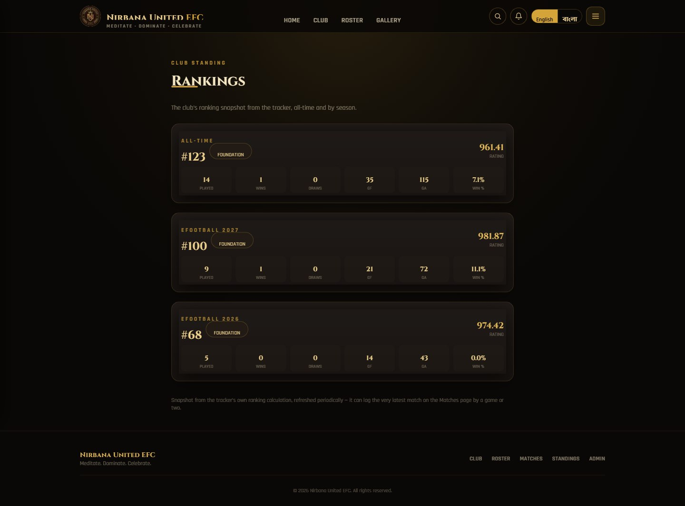

### News

Club announcements and updates, each with its own comment thread.

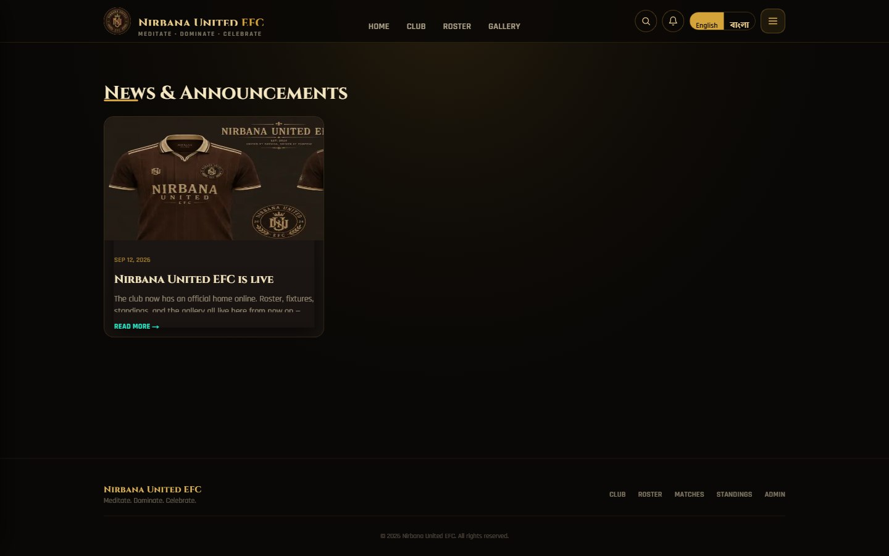

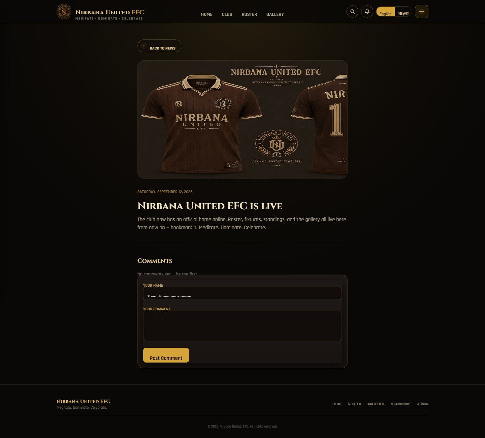

### Gallery

A photo grid with a full-screen lightbox viewer — every photo can be
commented on too.

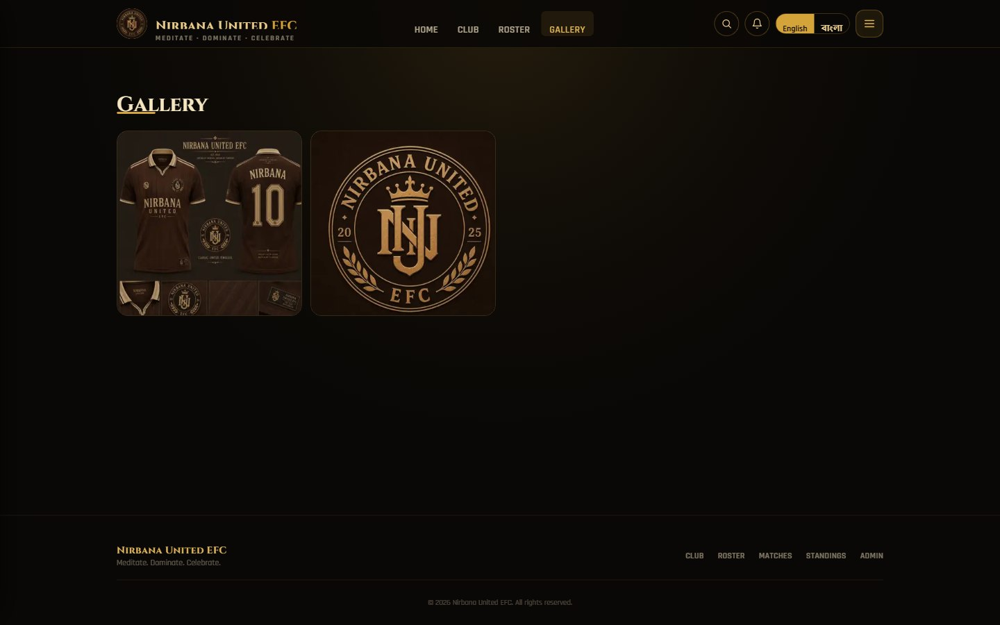

---

## Fully bilingual

Every single string on the site — navigation, labels, dates, even the
tracker-sourced stats — is available in Bengali as well as English, switched
instantly from the navbar with no page reload delay.

---

## Built for mobile

The whole site is fully responsive — here's the same homepage on a phone
screen.

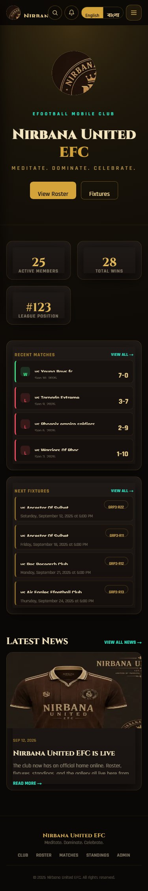

---

## Admin panel

Behind a secure login, the club captain manages every piece of content on
the site — no code, no database tools, just forms.

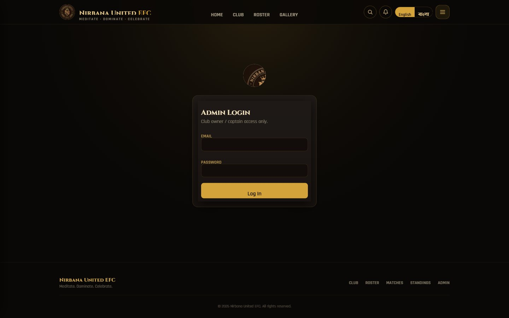

From the dashboard, the admin can: add, edit, or remove players and their
photos; record match results and upcoming fixtures; publish news posts;
update the club's standings row; upload gallery photos; moderate pending
visitor comments with one click; edit the club's About text; and trigger an
immediate data sync from the tracker instead of waiting for the next
automatic hourly run.

---

## What makes this project technically interesting

- **A real automatic data pipeline**: rather than manually retyping stats
  after every match, a background job scrapes the club's public tracker
  page every hour, cross-checks every number against the tracker's own
  totals before writing anything, and safely does nothing at all if the
  tracker's page layout ever changes unexpectedly — no bad data ever
  reaches the site.
- **One codebase, two databases**: SQLite for zero-setup local development,
  Postgres in production — switched automatically based on environment,
  with no code changes needed.
- **Hand-built data visualizations**: the donut charts, bar comparisons, and
  trend lines on player profiles are custom SVG/CSS, not a third-party
  charting library — kept lightweight and fully styled to match the site's
  own design.
- **Defense in depth on security**: every admin action is protected at both
  the routing layer and the individual API-route layer independently, all
  input is schema-validated, and comment authorship is checked server-side
  against the live roster so nobody can fake being a player who doesn't
  exist (or isn't on the team anymore).
- **Zero-cost hosting**: the entire stack — hosting, database, image
  storage, and the hourly background job — runs on Netlify's free tier.

---

## Tech stack

Next.js 14 (App Router) · TypeScript · React 18 · Tailwind CSS · Prisma ·
SQLite / PostgreSQL · next-intl · Netlify (Hosting, Database, Blobs,
Scheduled Functions) · Zod · bcrypt

---

*For the full technical documentation — data model, every API route,
security details, deployment steps, and the complete list of fixes made
during development — see* **DOCUMENTATION.md** *in this repository.*
